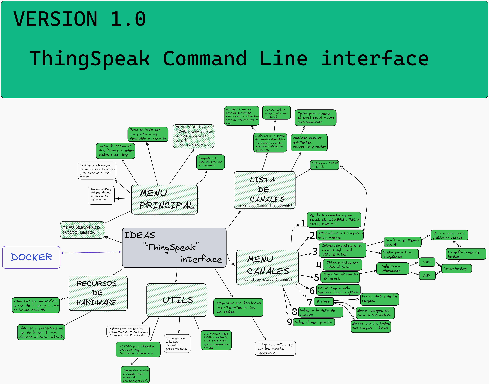

# ThingSpeak Command Line Interface

## PREVIEW
Programa para interactuar desde la linea de comandos con tu cuenta de **ThingSpeak.** 

## **DESCARGAR**

    git clone https://github.com/mikelgoti/ThingSpeak-INTERFACE.git

## **FORMA DE USO** 

### **USANDO DOCKER**

Dirígete hasta el directorio donde hayas descargado el programa. Una vez en el directorio abre una terminal.

Construye el contenedor de **docker**:

    docker build -t <nombre del contenedor> .
Es **importante** añadir un espacio y el punto del final.

Cuando se haya construido la imagen de Docker se puede iniciar de la siguiente forma:

    docker run -it <nombre del contenedor>
   
  La flag **-it** indica a docker que el contenedor se tiene que inicializar en modo interactivo. Es muy **importante** abrirlo de esta manera ya que el programa requiere de inputs externos para crear canales, borrarlos, etc ...

Tambien puedes especificar la opción **-rm** para que la imagen se borre sola después de la ejecución del contenedor.

    docker run -it -rm <nombre del contenedor>
   

#### Accede al directorio dentro del contenedor de docker
Es **importante** que primero corras el contenedor con la opcion run de arriba. 

Una vez corriendo mira los procesos de docker con:

    docker ps

Copia el nombre de la imagen random que se a generado .No el que tu has introducido. Esto se debe a que Docker crea un id random para identificar multiples instancias de la misma imagen.

Para acceder al directorio del proyecto cuando este se encuentra en el contenedor de docker, puedes hacerlo de la siguiente manera:

    docker exec -it <nombre_random> /bin/bash
En la propia terminal en la que estas se abrirá una shell dentro del container. 

Pudes ver el contenido del directorio con:

    ls 

### **SIN USAR DOCKER**

El programa ha sido escrito en un ambiente virtual usando **anaconda**. Se ha escrito usando la versión 3.7.16 de python. Tambien es importante saber que tiene dependencias de otros paquetes que hay que instalar.  Debido a todo esto, es una buena opción utilizar docker, ya que automatiza de forma sencilla el ambiente virtual mediante los contenedores que docker provee. Aun así se puede instalar todo manualmente.

Es recomendable instalar la versión de python 3.7.16 para un funcionamiento óptimo.

**LISTA DE DEPENDENCIAS QUE SE DEBERÁN INSTALAR**

    pip install pandas
    pip install psutil
    pip install openpyxl
    pip install request
    pip install selenium

